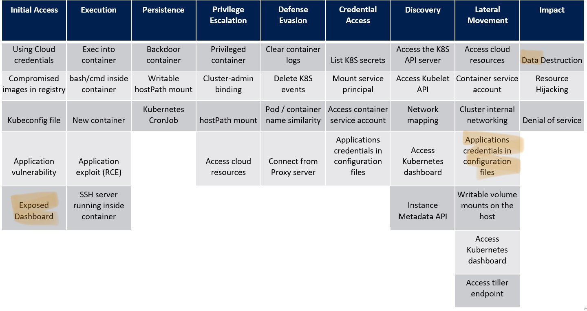

# Profit the K8s Dashboard

Exposed and unprotected Kubernetes dashboard is one of the most common *attack entrypoints* on K8s clusters.

> Note the [RedHat's article](https://cloud.redhat.com/blog/cryptojacking-attacks-in-kubernetes-how-to-stop-them) on Crytptojacking attacks in Kubernetes and how to stop them.

---

*Kubernetes threat matrix for a generic resource hijacking attack*

---

## Attack on Tesla, 2018

[Tesla 2018](https://redlock.io/blog/cryptojacking-tesla)

- Also, accidentally exposed K8s dashboard
- AWS S3 creds were stolen
- mining Monero on their K8s cluster
- carefully hiding presence of mining pods (CPU utilisation throttling, using non-default mining pools, hiding IP via CloudFare CDN)


## Attack(s): reports by Azure Security Center, 2019-2021

[April 2019](https://azure.microsoft.com/en-us/blog/detect-largescale-cryptocurrency-mining-attack-against-kubernetes-clusters/), [June 2020](https://www.microsoft.com/security/blog/2020/06/10/misconfigured-kubeflow-workloads-are-a-security-risk/), [May 2021](https://techcommunity.microsoft.com/t5/azure-security-center/new-large-scale-campaign-targets-kubeflow/ba-p/2425750)

- using Monero docker image from public dockerhub
- mining pods running as dashboard’s service account, which means they were deployed via a K8s dashboard
- 2020 & 2021: attacking Kubeflow's pipelines to deploy mining images


## Attack on ${NAME}, June 2021

> For sake of our own safety we don't name the company

[July 21](https://habr.com/ru/post/568842/) (user's public report), [July 22](https://habr.com/ru/post/569176/) (tech team's report)

### Description:
- ingress.enabled=true (NOT default) + mistake in ingress configuration => Kubernetes WebView dashboard is available via several public DNS names
- unprotected dashboard (no auth)
- read-only access (cannot create new K8s object) to all K8s namespaces
- [secrets were hidden by default](https://codeberg.org/hjacobs/kube-web-view/src/commit/bc5231296/deploy/deployment.yaml#L27-L29) in the dashboard (`--show-secrets`), however the team stored some secrets in config maps (!)
- [container logs were accessible](https://codeberg.org/hjacobs/kube-web-view/src/commit/bc5231296/deploy/deployment.yaml#L24-L26), which is NOT default (`--show-container-logs`), in addition, the DEBUG mode was enabled on the production servers

> Note: other secrets like DB credentials might have been leaked to be used for future attacks (however, the team has claimed to have all secrets rotated) after the attack was discovered.


## Demo: attack on ${NAME}

### Attack description:
- **Setup**: a K8s cluster with an application + database deployed in one namespace, K8s read-only dashboard deployed in another namespace
- **Attacker**: an external user without any access to the cluster
- **Target**: application data
- **Entrypoint**: K8s dashboard

### Steps to reproduce:
1. deploy the kubernetes dashboard [./kube-web-view](kube-web-view) in an insecure way
2. deploy the mock email-sending service [./mock-email-service](mock-email-service)
3. explore the service at [mock-email.seck8s.slurm.io](http://mock-email.seck8s.slurm.io), register a user
4. explore the dashboard:
   - [http://anything.seck8s.slurm.io/](http://anything.seck8s.slurm.io/)
   - [http://rus-vote.seck8s.slurm.io/](http://rus-vote.seck8s.slurm.io/)
   - [nodes](http://rus-vote.seck8s.slurm.io/clusters/local/nodes)
   - [secrets](http://rus-vote.seck8s.slurm.io/clusters/local/namespaces/_all/secrets?), namely [mock-email/mock-secret](http://rus-vote.seck8s.slurm.io/clusters/local/namespaces/mock-email/secrets/mock-secret) (content hidden by the dashboard)
   - [config maps](http://rus-vote.seck8s.slurm.io/clusters/local/namespaces/_all/configmaps?), namely [mock-email/mock-email-db-secret](http://rus-vote.seck8s.slurm.io/clusters/local/namespaces/mock-email/configmaps/mock-email-db-secret) (can read the base64-encoded secrets)
   - [pods](http://rus-vote.seck8s.slurm.io/clusters/local/namespaces/_all/pods?) or deployments, namely read [logs of the mock-email/mock-email-app](http://rus-vote.seck8s.slurm.io/clusters/local/namespaces/mock-email/deployments/mock-email-app/logs)
5. cleanup:
   ```sh
   k -n mock-email delete -f ./deploy
   k delete ns mock-email
   # (dashboard will be used later)
   ```


## Takeaways
- do not expose the Kubernetes dashboard to the Internet
- use RBAC
- dashboard's SA has very limited permissions
- regularly monitor the runtime environment (this includes monitoring the running containers, their images, and the processes that they run)
- be careful with debug mode in production and sensitive information in logs
- keep your image registry safe
